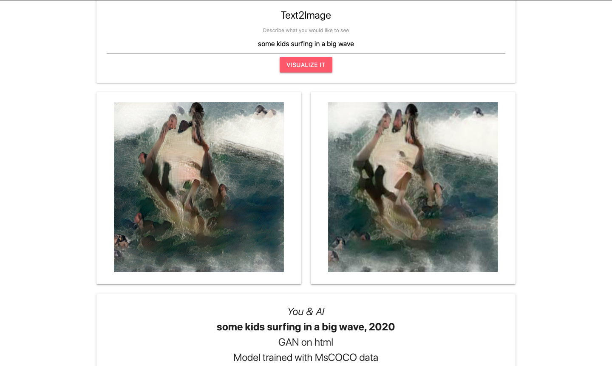

## You•AI 
> Text to Image (and Latent Space Interpolation) Installation




**Our work is based on the results from 
[Semantic Object Accuracy for Generative Text-to-Image Synthesis](https://arxiv.org/abs/1910.13321)** <br>

For our latent space interpolation we chose to use the overall latent vector in AttnGan, which leaves us with  the
scene videos. Through fixed positional arguements and fixed text embedding, the scene gets in motion.<br>

Video: [Ars Electronica Center Submission](https://www.youtube.com/watch?feature=youtu.be&v=IvSGvkCjBRU) <br>


## Requirements

* 64-bit Python 3.6 installation
* TensorFlow 1.15 with GPU support. The code does not support TensorFlow 2.0.
* A NVIDIA GPU, NVIDIA drivers, CUDA 10.0 toolkit and cuDNN 7.5. To use the super resolution option, you need an NVIDIA GPU with at least 16 GB of DRAM.
* Firefox, Google Chrome and Safari are supported web browsers to open the flask application

## Install and Run Flask Application

Make sure you are satisfying the requirements, before installing packages with pip. Virtual environment is strongly
recommended to avoid conflicts.

`(venv) $ git clone https://github.com/PhilippMaxx/Text2Image`

`(venv) $ cd Text2Image`

`(venv) $ pip install -r requirements.txt`

`(venv) $ cd myapp`

Install the required nltk tokenizer:

`(venv) $ python -c "import nltk; nltk.download('punkt')"`

Launch the flask app:

`(venv) $ export FLASK_APP=application.py`

`(venv) $ flask run`

You should see a notice from flask like:

```
 * Serving Flask app "application.py"
 * Environment: production
   WARNING: This is a development server. Do not use it in a production deployment.
   Use a production WSGI server instead.
 * Debug mode: off
 * Running on http://127.0.0.1:5000/ (Press CTRL+C to quit)
```
Now you can open the serving link `http://127.0.0.1:5000/` in one of the recommended browsers and use the application.